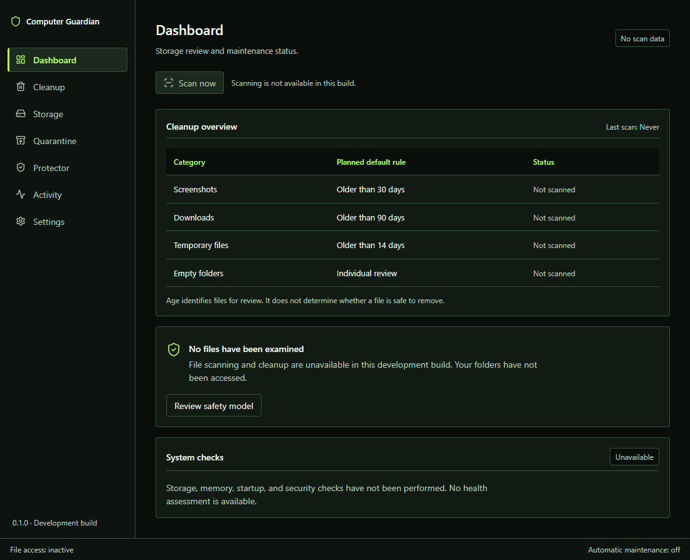

# Computer Guardian

A desktop utility being built for reviewing storage and computer health, with explicit control over every file operation.



This screenshot shows the current black-and-neon first-run interface in Edge on Windows. It is not a native Tauri window, and no sample file or health data is injected. [Light appearance](docs/screenshots/dashboard-light.png) · [Dark appearance](docs/screenshots/dashboard-dark.png).

## Why this project exists

Cleaning storage should be an understandable decision. Computer Guardian is designed to show which files were found, why they were identified, and how to recover them before permanent deletion is considered.

## Features and current status

Version 0.1.0 is **unreleased**. The current milestone adds read-only Windows storage and duplicate analysis to the conservative quarantine workflow:

- Seven navigation destinations with explicit feature-availability messages.
- Keyboard navigation and a modal safety explanation with focus containment and restoration.
- Black-and-neon first-launch appearance, plus system, light, and dark options saved locally.
- Compact cleanup-category table with planned rules clearly identified.
- In the native app only: choose one folder, scan file metadata, view counts and review candidates, and cancel an in-progress scan. A 100,000-entry limit bounds traversal; the result stores at most 500 candidates.
- Measure fixed and removable local-drive capacity through Windows without reading file contents. The Storage screen shows exact free/used values, a text-labelled capacity meter, and an explicit low-free-space review signal rather than a health score.
- Scan only existing approved common locations—Downloads, Desktop, Pictures/Screenshots, and the Windows temporary directory—in one bounded, cancellable operation. It never expands this action into a whole-drive, Documents, Windows, or program-folder scan.
- Analyze one explicitly selected folder for duplicate files. Rust groups non-empty files by metadata size, then streams SHA-256 only for same-size candidates. The report shows verified groups and potentially reclaimable space but offers no move or delete action. Traversal is capped at 100,000 entries, hashing at 50 GB, output at 200 groups, and displayed paths at 50 per group.
- Classify old screenshots, old downloads, temporary-file candidates, and empty folders for review using explicit reasons. The default age thresholds are 30, 90, and 14 days respectively and can be changed from 1 to 3650 days.
- Save up to 50 relative-path exclusions locally. Absolute paths, traversal segments, wildcards, and malformed settings are rejected in both TypeScript and Rust. Every result retains the rules used when that scan started.
- Filter and inspect candidates in Cleanup. The interface shows at most 100 matching rows at once. In the native app, one current scan candidate can be moved to private local Quarantine only after confirmation.
- Restore quarantined files and empty folders to their original locations. Restore refuses to overwrite an existing item, and changed or stale scan candidates are rejected.
- Keep permanent deletion unavailable. Quarantine records are journaled locally before a move and recovered from the payload state after an interrupted marker write.
- Explain the future Protector scope without presenting fake measurements, an antivirus claim, or a security score.
- Visible file-access and automatic-maintenance status.

The cleanup scanner does not read file contents, classify files as safe to delete, or scan automatically. Duplicate analysis reads only same-size candidate contents locally and does not retain or expose their hashes. Known protected system folders, symlinks/junctions, repository/dependency directories, and configured relative exclusions are skipped or rejected. Cross-drive quarantine, permanent deletion, SQLite activity history, scheduling, and memory/startup/security providers are not implemented. The browser preview cannot read drive capacity, scan, analyze duplicates, quarantine, or restore.

## Safety model

The planned workflow is **scan → understand → review → quarantine → delete**.

Files must be individually reviewable. Age and extension are signals, not evidence that a file is unnecessary. Protected paths, exclusions, reparse points, changed files, locked files, and permission failures must be handled before cleanup can be enabled. Restore must never silently overwrite another file.

Permanent deletion is excluded from the first release. Quarantine and restore are available only for individually confirmed candidates from the latest completed scan. They are not automatic cleanup.

## Privacy

The application has no account, telemetry, remote fonts, cloud classification, or file uploads. Scan results and duplicate hashes stay in memory and disappear when the app closes. File content read for duplicate verification never leaves the computer. Quarantined payloads and their recovery journals stay in the app's private local data folder until restored. The color theme, scan thresholds, and relative exclusions are persisted in versioned local preferences. The development server and package installation use networking during development; the built interface has no external service dependency.

## Architecture

React and TypeScript provide the interface. Tauri provides the desktop host; Rust owns Windows drive-capacity enumeration, approved-location resolution, filesystem traversal, cancellation, classification, bounded duplicate hashing and result summaries, current-candidate validation, quarantine journaling, moves, and restore. JSON recovery journals are used for this milestone; SQLite remains planned for durable activity history.

Shared controls and semantic CSS tokens live in `src/components` and `src/styles.css`. Screens live in `src/features`; browser tests live in `tests/browser`. See [architecture decisions](docs/architecture.md) and the [quality standard](docs/quality-standard.md).

## Installation and platform status

There is no supported production release yet. Local unsigned Windows test installers can be produced for development evaluation.

The React build, Edge browser tests, Rust tests, a native Tauri development launch, a standalone Windows executable, and MSI/NSIS test bundles have been verified on Windows. The installers are unsigned development artifacts, not a supported production release. Native macOS and Linux builds have not been tested; cross-platform support is a target, not a current compatibility claim.

For a browser preview, install Node.js 22.12 or later, open the repository directory, and run:

```powershell
npm ci
npm run dev
```

Open the local address printed by Vite, normally `http://127.0.0.1:5173`. Stop the server with Ctrl+C. Previewing the interface does not require Rust.

## Development

```powershell
npm run typecheck
npm run build
npm test
npm run test:e2e
```

Browser tests use an installed Microsoft Edge. On a machine without Edge, install the test channel with `npx playwright install --with-deps msedge`. The tests start their own local server on port 5173; stop any existing server first.

For native development, install stable Rust and the [Tauri prerequisites](https://v2.tauri.app/start/prerequisites/) for your operating system. Windows requires the MSVC build tools and WebView2. Then:

```powershell
npm run tauri dev
```

This command launched the native window on the development workstation after loading the Visual Studio C++ environment. If you just installed Rust or Build Tools, restart Windows and open a new terminal so Cargo, MSVC, and the Windows SDK are discoverable. `npm run tauri build` creates local desktop bundles; `npm run build` only produces frontend assets in `dist/`.

Tests use isolated browser storage and never scan user folders. Rust scanner, duplicate-analysis, and quarantine tests use temporary directories. They verify full-content duplicate matching, same-size differences, cancellation, successful move/restore, stale-item rejection, empty-folder restore, and no-overwrite behavior. The browser suite checks all destinations in both themes with axe, verifies modal keyboard behaviour, and checks narrow layout and saved appearance. Automated accessibility checks supplement manual inspection; they do not establish complete accessibility conformance.

## Roadmap

1. Harden manual quarantine, approved-location scanning, and safe restore with native end-to-end recovery scenarios and signed distribution.
2. Harden duplicate analysis with native end-to-end testing and an individually confirmed keep/remove workflow that defaults to quarantine.
3. Add durable local activity history.
4. Add opt-in scheduling and limited memory/startup/security providers after the first release.

Each phase must pass build, relevant tests, and UI inspection before the next is considered complete. The first release scope is defined in the [product specification](docs/product-specification.md).

## Contributing

Read [CONTRIBUTING.md](CONTRIBUTING.md). Changes should explain the problem, the resulting behaviour, and the tests or inspection used to verify it. The GitHub repository is private and no supported release has been published.

## Security

Read [SECURITY.md](SECURITY.md). A private reporting channel must be configured before public distribution.

## License

[MIT](LICENSE).
