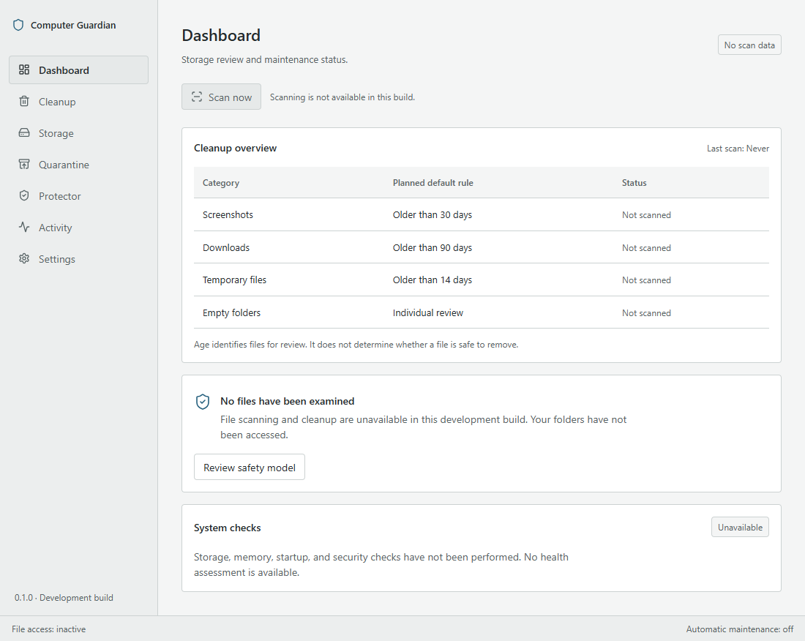

# Computer Guardian

A desktop utility being built for reviewing storage and computer health, with explicit control over every file operation.



This screenshot shows the real first-run interface in Edge on Windows. It is not a native Tauri window. No sample files, disk measurements, or health scores are injected. [Dark appearance](docs/screenshots/dashboard-dark.png).

## Why this project exists

Cleaning storage should be an understandable decision. Computer Guardian is designed to show which files were found, why they were identified, and how to recover them before permanent deletion is considered.

## Features and current status

Version 0.1.0 is **unreleased**. The current milestone is the application shell:

- Seven navigation destinations with explicit feature-availability messages.
- Keyboard navigation and a modal safety explanation with focus containment and restoration.
- System, light, and dark appearance, saved locally.
- Compact cleanup-category table with planned rules clearly identified.
- Visible file-access and automatic-maintenance status.

Scanning, classification, quarantine, restore, SQLite persistence, scheduling, and system-health providers are not implemented. There are no filesystem commands exposed to the interface.

## Safety model

The planned workflow is **scan → understand → review → quarantine → delete**.

Files must be individually reviewable. Age and extension are signals, not evidence that a file is unnecessary. Protected paths, exclusions, reparse points, changed files, locked files, and permission failures must be handled before cleanup can be enabled. Restore must never silently overwrite another file.

Permanent deletion is excluded from the first release. Quarantine will remain disabled until restore and recovery tests pass.

## Privacy

The application has no account, telemetry, remote fonts, cloud classification, or file uploads. Only the color theme is currently persisted, in a versioned local preference. The development server and package installation use networking during development; the built interface has no external service dependency.

## Architecture

React and TypeScript provide the interface. Tauri provides the desktop host; Rust will own filesystem operations and platform adapters. SQLite is planned for operation history and quarantine metadata, but has not been added before a working consumer exists.

Shared controls and semantic CSS tokens live in `src/components` and `src/styles.css`. Screens live in `src/features`; browser tests live in `tests/browser`. See [architecture decisions](docs/architecture.md) and the [quality standard](docs/quality-standard.md).

## Installation and platform status

There is no installer or supported production release yet.

The React build and browser tests have been verified on Windows with Edge. Native Windows compilation is pending Rust and the system build prerequisites. Native macOS and Linux builds have not been tested; cross-platform support is a target, not a current compatibility claim.

For a browser preview, install Node.js 22.12 or later, open the repository directory, and run:

```powershell
npm ci
npm run dev
```

Open the local address printed by Vite, normally `http://127.0.0.1:5173`. Stop the server with Ctrl+C. Previewing the interface does not require Rust.

## Development

```powershell
npm run typecheck
npm run build
npm test
npm run test:e2e
```

Browser tests use an installed Microsoft Edge. On a machine without Edge, install the test channel with `npx playwright install --with-deps msedge`. The tests start their own local server on port 5173; stop any existing server first.

For native development, install stable Rust and the [Tauri prerequisites](https://v2.tauri.app/start/prerequisites/) for your operating system. Windows requires the MSVC build tools and WebView2. Then:

```powershell
npm run tauri dev
```

This command is the intended native development entry point; it has not yet been verified on this workstation. Packaging is a later milestone. Do not describe `npm run build` as producing a desktop executable: it produces frontend assets in `dist/`.

Tests use isolated browser storage and never scan user folders. The browser suite checks all destinations in both themes with axe, verifies modal keyboard behaviour, and checks narrow layout and saved appearance. Automated accessibility checks supplement manual inspection; they do not establish complete accessibility conformance.

## Roadmap

1. Verify the native shell and establish Rust test execution.
2. Add an explicit, cancellable scanner with protected-path and exclusion tests.
3. Add screenshot, age, temporary-file, and empty-folder classification.
4. Connect file review to scan results.
5. Add manual quarantine and safe restore together.
6. Add duplicate detection.
7. Add opt-in scheduling and limited system-health providers after the first release.
8. Package and harden supported platforms.

Each phase must pass build, relevant tests, and UI inspection before the next is considered complete. The first release scope is defined in the [product specification](docs/product-specification.md).

## Contributing

Read [CONTRIBUTING.md](CONTRIBUTING.md). Changes should explain the problem, the resulting behaviour, and the tests or inspection used to verify it. No public repository or release has been published from this workspace.

## Security

Read [SECURITY.md](SECURITY.md). A private reporting channel must be configured before public distribution.

## License

[MIT](LICENSE).
